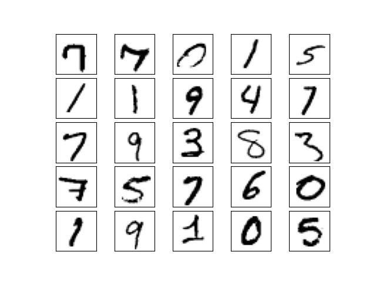

# Homework 10: Supervised Classification 

## Due: April 29, 2022 11:59pm ET

This homework asks you to fill in portions of code to classify an image dataset using three classifiers: the KNN, the SVM, and the MLP classifiers.

***IMPORTANT NOTE: In order to avoid multiple copies of the required data, we have shared the data on BrightSpace. 
Please download HW10 data from BrightSpace and create a data sub folder. From the course home page on BrightSpace go to 
"Content" -> "Data for HW10".***
Your *local* code repository should look as follows 
* hw10 root folder
   * data
      * train_data.npy
      * train_labels.npy
      * test_data.npy
      * test_labels.npy
   * hw10.py
   * README.md
   * utils.py
   * .gitignore
   * mnist.jpg

        
# Goals

In this assignment you will:
* Get familiar with dealing with image datasets.
* Learn the different stages of image classifications.
* Learn how to use some classifiers available in Python's sklearn package.
  
# Background

## Dataset
For this homework, we will be using the MNIST image dataset. Here is a brief description of this dataset from the official [website](http://yann.lecun.com/exdb/mnist/):

The MNIST dataset consists of 70000 28x28 grayscale images of handwritten digits. There are 60000 training images and 10000 test images.
Here are some sample images from the dataset.



To reduce your code runtime on this homework, we have provided you with the MNIST subset with  5000 images for training and 1000 images for testing.
For each of the following tasks, you have to complete the corresponding function definition and return the classification accuracy and confusion matrix using the provided test set.
While accuracy is a good way to quickly evaluate the performance of a classifier, it hides the detail you need to better understand the performance of your 
classification model i.e., its performance in individual classes. Therefore, we use the confusion matrix in addition to accuracy.   
For more information 
see [this link](https://en.wikipedia.org/wiki/Confusion_matrix).
 
## K-Nearest Neighbor (KNN)

k-nearest neighbor (kNN) is a classifier that 
requires no assumptions about the data (e.g., you don't need to know the image labels during training). It looks at the classes of the k-nearest points and 
picks the most frequent one. The choice of the value of k determines how representative your algorithm is. 
Please refer to the class notes for a more elaborate definition. 
You may want to look into [this documentation](https://scikit-learn.org/stable/modules/generated/sklearn.neighbors.KNeighborsClassifier.html) for the homework.

## Support-Vector Machine (SVM)

SVM is a supervised machine learning algorithm which strives to increase the maximum margin hyperplane separating the data classes while training.
Please refer to the class notes for more details. You may want to look into [this documentation](https://scikit-learn.org/stable/modules/svm.html) 
to learn more about its implementation.

## Multi-layer Perceptron (MLP)

MLPs are supervised classification techniques which involve layering of multiple perceptron unit. 
This helps in solving non-linear classification tasks as well as linear classification. Please refer to your class notes for more details. 
You may want to look into [this documentation](https://scikit-learn.org/stable/modules/generated/sklearn.neural_network.MLPClassifier.html) for your code.

# Instructions

## Packages
If you don't have the `scikit-learn` and `scikit-image` packages already installed in your
environment, you can use the following commands to install them:

```
python3 -mpip install --user scikit-learn
python3 -mpip install --user scikit-image
```
> Note: if you're on Windows, just use `pip3 install scikit-learn` and `pip3 install scikit-image`

## Set up your repository for this homework.

The repository should contain the following files:

1. This README.md.
2. `utils.py` which contains a code for you to explore the provided dataset.
3. `hw10.py` which contains function definitions for KNN, SVM and MLP.
4. `data` folder which contains the MNIST subset.
5. `.gitignore` file will ignore the `data` folder in your commit(s). 
You don't have to do change anything in this file, you can use your usual `git` commands and/or interface for pushing your code.

## Homework Problem 0: Exploring your dataset

In this task, we ask you to run the `utils.py` file to visualize some sample images from the filtered MNIST dataset with 5000 images for training and 1000 for testing. 
dataset. By default, the code will display a 5x5 grid of random images. Explore
your dataset in this way and see what do the images look like. You can
increase/decrease the number of images displayed as you wish.

Note: you do not need to submit anything or fill in any code for this task. This is just for your own exploration.

## Homework Problem 1: The K-nearest-neighbor classifier

In `hw10.py`, complete the skeleton function `get_KNN_results` for classifying the dataset using
the k-nearest-neighbor where k=5. Your task is to classify the MNIST dataset using KNN for values of k
For the given value of k, return the accuracy and the confusion matrix. For example, for k=5 the accuracy and confusion matrix are:
```
Accuracy: 0.91
[[ 83   0   0   0   0   0   2   0   0   0]
 [  0 126   0   0   0   0   0   0   0   0]
 [  4   5  95   1   1   0   2   6   2   0]
 [  0   2   1  97   0   2   1   2   0   2]
 [  0   1   0   0 100   0   1   1   0   7]
 [  1   1   0   0   2  80   0   0   2   1]
 [  3   0   0   0   1   0  83   0   0   0]
 [  0   6   1   0   1   1   0  88   0   2]
 [  3   2   0   4   2   3   2   0  70   3]
 [  0   0   0   0   2   0   0   2   2  88]]

```


## Homework Problem 2: The Support-Vector Machine classifier

In `hw10.py`, complete the skeleton function `get_SVM_results` for classifying the MNIST
dataset using the SVM classifier. Your task is to fill in the missing parts of
the code and return the accuracy and the confusion matrix for SVM.

Note: ignore any warning message you might encounter about convergence.

## Homework Problem 3: The Multi-layer Perceptron classifier

In `hw10.py`, complete the skeleton function `get_MLP_results` for classifying the MNIST
dataset using the MLP classifier. Your task is to fill in the missing parts of
the code and return the accuracy and the confusion matrix for SVM.

Note: ignore any warning message you might encounter.

# Steps to submit your work

Push your completed version of `hw10.py`
